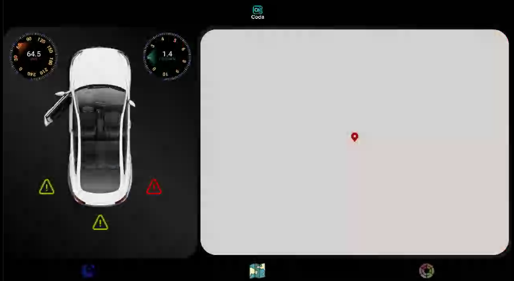

# IVI-Coda

## Introduction
This is the IVI app in Coda: a native Android application following MVVM architecture for the best performance. 

The app is designed to run on Android Automotive OS 15 with the [Coda](https://github.com/Coda-ITI/Coda) vendor package on a Raspberry Pi 5. Note that the app utilises custom VHAL properties and AIDL interfaces, and lots of custom logic that is necessary for building the app and running it successfully. You can simply utilise the created [repo manifest](https://github.com/Coda-ITI/android_local_manifest) to fetch everything related to the IVI Node for you if you want to run it yourself.

## Design Overview

## Main Features
1. Interactive Map.
2. Ambient Light Control.
3. Theme Change Via RROs (Defined in The Vendor Package)
4. Car Data Visualization: car doors' state, safe distance via Ultrasonic sensors, speed, and rpm.

## Design Architecture
The app follows single activity design methodology as well as MVVM architecture for the smoothest performance possible. The logic itself is not complex but the app utilises advanced syntax to accomplish some of the missions it is design to do.

The main components are:
1. MainActivity: where all of the main logic is housed. It handles theme change either via the icon or via Voice Command by enabling/disabling the RRO and sending the flag to ObservationService to publish it via vSOME/IP.
2. CarDataViewModel: where the received data via callback is transfered to the MainCarFragment. The Callbacks are registered via AIDL to the ObservationService responsible for receiving the data via vSOME/IP. 
3. MainCarFragment: a fragment that is constantly loaded at the left side of the screen to show the the received data. It constantly observes the data via the ViewModel and updates UI elements.
4. NavigationFragment: a fragment that shows a map + current location.
5. AmbientFragment: a fragment that allows the user to change ambient light.
